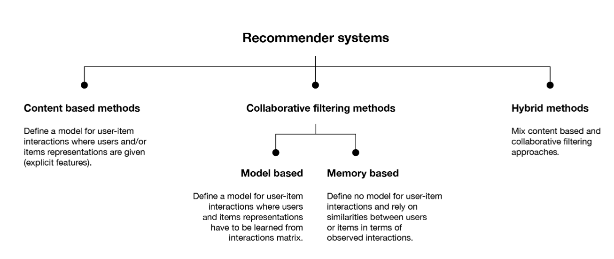
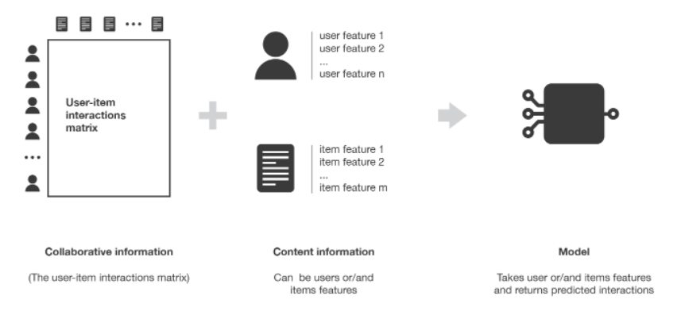
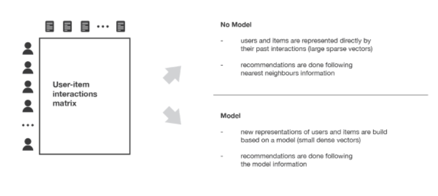
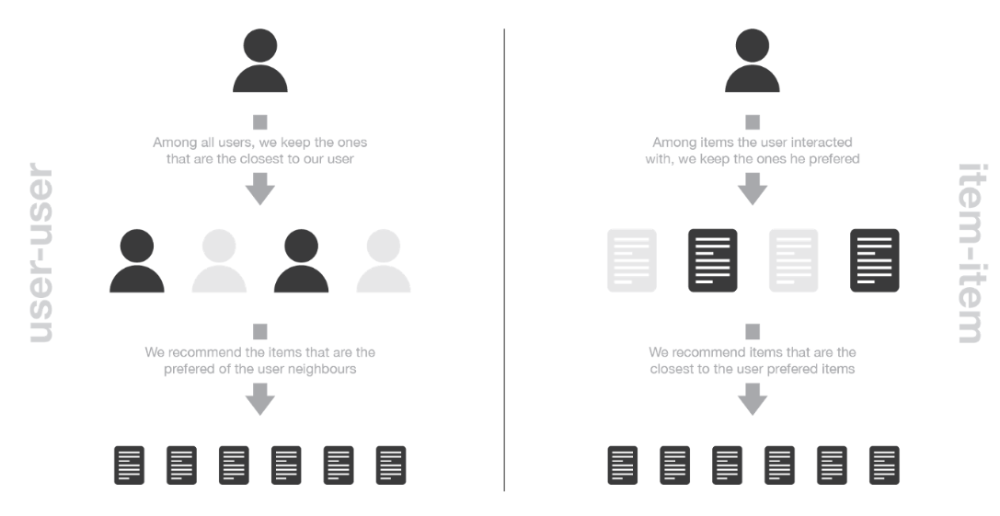
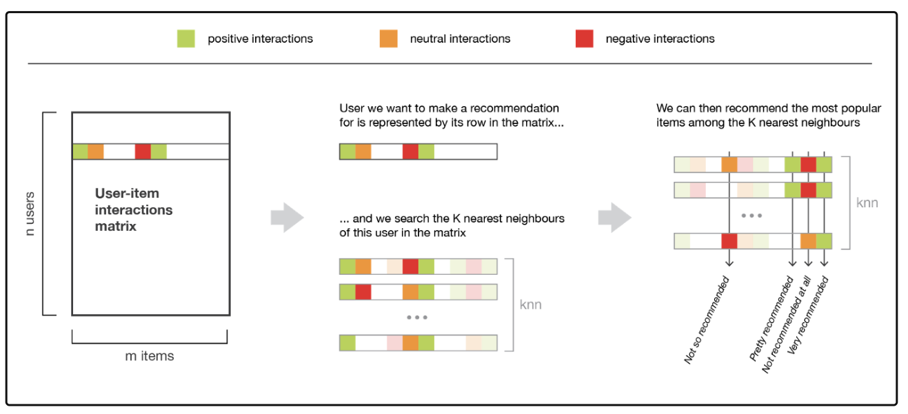
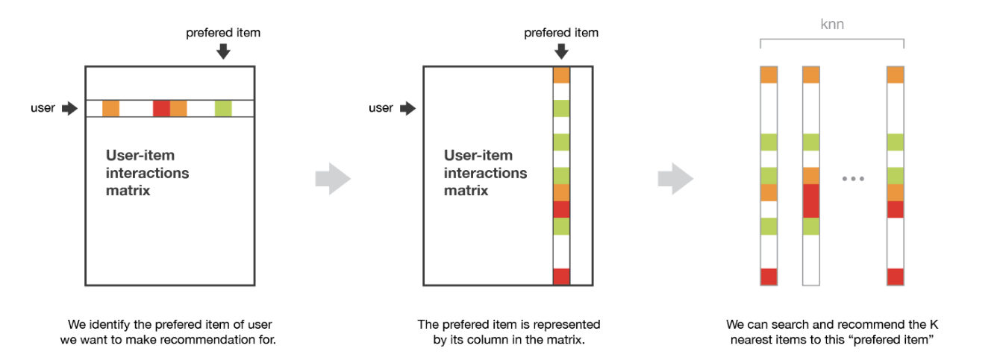
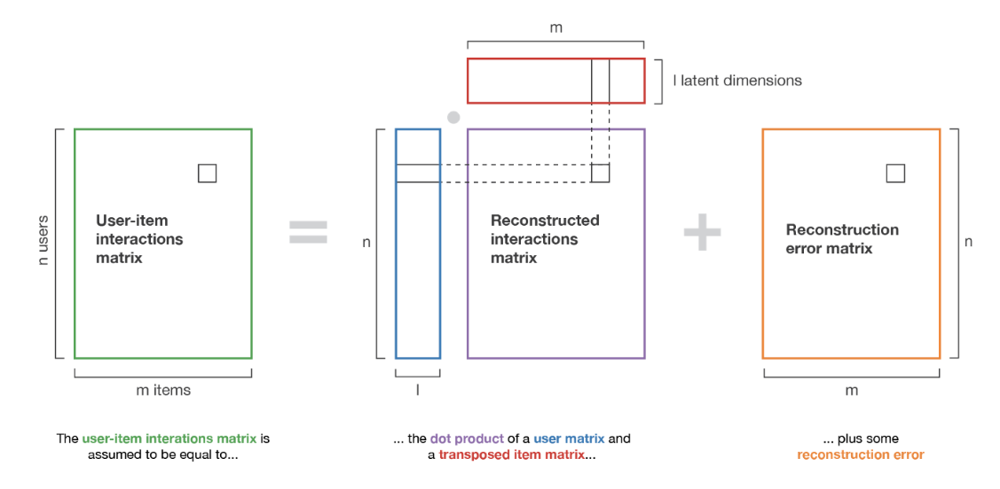

- Every time you get a new project the first thing you should do is try to understand the basics; **when and what it will be used for**, **the structure of a system**, **the variety**, and **the scalability that it could have**.

## What are Reccomender Systems

- Recommender systems are part of information filtering systems and AI which aim to predict the preferences that someone will have over a plethora of choices.

- Recommender systems improve individual customer experiences, by suggesting content for your website.

- They are the most common application of big data.

- The most common area of use is product recommendation field filtering and learning through customers’ preferences.

> 40% of app installs on Google Play come from recommendations.
> 60% of watch time on YouTube comes from recommendations.

## Basic Terminologies

- Items (also known as documents)

  - The entities a system recommends.
  - For YouTube, the items are videos.

- Query (also known as context)

  - The information a system uses to make recommendations.
  - Queries can be a combination of the following:

    - user information
    - the id of the user
    - items that users previously interacted with

  - additional context
    - time of day
    - the user's device

- Embedding
  - A mapping from a discrete set (in this case, the set of queries, or the set of items to recommend) to a vector space called the embedding space.
  - Many recommendation systems rely on learning an appropriate embedding representation of the queries and items.

## System Overview

- One common architecture for recommendation systems consists of the following components:

  - candidate generation
  - scoring
  - re-ranking

- Candidate Generation

  - Here the system starts from a potentially huge corpus and generates a much smaller subset of candidates.
  - The model needs to evaluate queries quickly given the enormous size of the corpus.
  - A given model may provide multiple candidate generators, each nominating a different subset of candidates.
  - For example, the candidate generator in YouTube reduces billions of videos down to hundreds or thousands.
  - 2 common candidate generation approaches are content-based filtering and collaborative filtering.

- Scoring

  - Next, another model scores and ranks the candidates in order to select the set of items (on the order of 10) to display to the user.
  - As this model evaluates a relatively small subset of items, the system can use a more precise model relying on additional queries.

- Re-ranking

  - Finally, the system must take into account additional constraints for the final ranking.
  - Re-ranking can also help ensure diversity, freshness, and fairness.
  - For example, the system removes items that the user explicitly disliked or boosts the score of fresher content.

## Types of Reccomender System

- There are 3 major types of AI recommendation systems:

  - **Content-Based Filtering** recommender systems identify similar products based on their attributes, i.e. the characteristics of each product.

    - We represent every product with its attributes (for example, the attributes of a mobile phone are Screen size, Price, Camera, Software, etc.) and we try to find the most similar ones.
    - In this way, we suggest similar “mobile phones” to someone with an interest for a mobile with specific characteristics.

  - **Collaborative Filtering** engines identify the preferences of similar customers and are based on the idea that people with similar behavior share similar interests.

    - In these systems, we represent every customer with their interactions and this way, we predict the probability of their interest for every product, that is, the likelihood of the customer actually appreciating the product recommended to them.
    - As a result, we can approach a new customer by recommending products for the most similar ones.

  - **Hybrid Systems** are the combination of Content-Based and Collaborative Filtering recommender systems.

    - Score every given product from both models and weigh each result; the final recommendations will result from the linear combination of the 2 scores.

  - 

- Other other type of AI recommendation systems includes:

  - **Association Rules or Market Basket Analysis** engines are slightly different from the previous ones.

    - Having a large data set of interaction data we can find patterns for items frequently purchased together as a sequence; for example if someone has added coffee to his cart but hasn’t added sugar, we recommend sugar.

  - **Repeat Purchase** engines predict the specific time or approximate time by which a customer will have purchased a specific product.

    - This algorithm uses the product duration, purchase history and day statistics in order to predict the future date.
    - For example, if someone buys monthly fruits, we recommend the same product every 30 days in case they have forgotten to purchase them. This way, we encourage them to continue shopping with our store.

## Content Based Filtering

- The idea of content based methods is to try to build a model, based on the available **features**, that explain the observed user-item interactions.

- 

- Content based methods suffer far less from the cold start problem than collaborative approaches: new users or items can be described by their characteristics (content) and so relevant suggestions can be done for these new entities.

  - Only new users or items with previously unseen features will logically suffer from this drawback, but once the system old enough, this has few to no chance to happen.

- In content based methods some latent interaction model is also assumed. However, here, the model is provided with content that define the representation of users and/or items: for example, users are represented by given features and we try to model for each item the kind of user profile that likes or not this item.
  - Here, as for model based collaborative methods, a user-item interactions model is assumed. However, this model is more constrained (because representation of users and/or items are given) and, so, the method tends to have the highest bias but the lowest variance.

## Collaborative Filtering

- Collaborative methods for recommender systems are methods that are based solely on the past interactions recorded between users and items in order to produce new recommendations.

  - These interactions are stored in the so-called **user-item interactions matrix**.

- We can implement them with one of two methods that are generally called memory based and model based approaches:

  

  - In Memory-based we measure the distance (Euclidian Distance and Cosine Distance) between all the vectors (customers) with each other and recommend products from the most similar (nearest neighbours search).

    - They directly works with values of recorded interactions, assuming no model, and are essentially based on nearest neighbours search.

    - In memory based collaborative methods, no latent model is assumed. The algorithms directly works with the user-item interactions.

    - for example, users are represented by their interactions with items and a nearest neighbours search on these representations is used to produce suggestions.

    - As no latent model is assumed, these methods have theoretically a low bias but a high variance.

  - In Model-based also known as matrix factorization model for recommender systems, we recognize latent factors (a set of variables which explain (describe) other variables and their relationship in a lower dimensional space without losing the information) in data.

    - Latent factors find and decode patterns for every customer in order to identify the similarities between them.

    - In model based collaborative methods, some latent interaction model is assumed. The model is trained to reconstruct user-item interactions values from its own representation of users and items.

    - New suggestions can then be done based on this model.

    - The users and items latent representations extracted by the model have a mathematical meaning that can be hard to interpret for a human being.

    - As a (pretty free) model for user-item interactions is assumed, this methods has theoretically a higher bias but a lower variance than methods assuming no latent model.

  - In both methods, we represent customers with their interactions like vectors formatting a matrix.

- The main advantage of collaborative approaches is that they require no information about users or items and, so, they can be used in many situations.

- As it only consider past interactions to make recommendations, collaborative filtering suffer from the **cold start problem**.

  - It is impossible to recommend anything to new users or to recommend a new item to any users and many users or items have too few interactions to be efficiently handled.
  - This drawback can be addressed in different way:
    - Recommending random items to new users or new items to random users (random strategy)
    - Recommending popular items to new users or new items to most active users (maximum expectation strategy)
    - Recommending a set of various items to new users or a new item to a set of various users (exploratory strategy)
    - Using a non collaborative method for the early life of the user or the item.

## Memory Based Collaborative Approach

- The main characteristics of user-user and item-item approaches it that they use only information from the user-item interaction matrix and they assume no model to produce new recommendations.

- 

- **User-User**

  - In order to make a new recommendation to a user, user-user method roughly tries to identify users with the most similar “interactions profile” (nearest neighbours) in order to suggest items that are the most popular among these neighbours (and that are “new” to our user).
  - This method is said to be “user-centred” as it represent users based on their interactions with items and evaluate distances between users.
  - Note to consider that two users are similar if they have interacted with a lot of common items in the same way (similar rating, similar time hovering etc).
  - 
  - The user-user method is based on the search of similar users in terms of interactions with items. As, in general, every user have only interacted with a few items, it makes the method pretty sensitive to any recorded interactions (high variance).
  - As the final recommendation is only based on interactions recorded for users similar to our user of interest, we obtain more personalized results (low bias).

- **Item-Item**

  - The idea of item-item method is to find items similar to the ones the user already positively interacted with.
    - Two items are considered to be similar if most of the users that have interacted with both of them did it in a similar way.
  - This method is said to be “item-centred” as it represent items based on interactions users had with them and evaluate distances between those items.
  - 
  - As, in general, a lot of users have interacted with an item, the neighbourhood search is far less sensitive to single interactions (lower variance).
  - Also interactions coming from every kind of users (even users very different from our reference user) are then considered in the recommendation, making the method less personalised (more biased).
  - This approach is less personalized than the user-user approach but more robust.

- One of the biggest flaw of memory based collaborative filtering is that they do not scale easily.

  - For systems with millions of users and millions of items, the nearest neighbours search step can become intractable if not carefully designed (KNN algorithm has a complexity of O(ndk) with n the number of users, d the number of items and k the number of considered neighbours).
  - To make computations more tractable for huge systems, we can both take advantage of the sparsity of the interaction matrix when designing our algorithm or use approximate nearest neighbours methods (ANN).

- It is necessary to be extremely careful to avoid a _rich-get-richer_ effect for popular items and to avoid getting users stuck into what could be called an _information confinement area_.
  - Meaning, we do not want that our system tend to recommend more and more only popular items as well as we do not want that our users only receive recommendations for items extremely close to the one they already liked with no chance to get to know new items they might like too (as these items are not “close enough” to be suggested).
  - These problems can arise in most of the recommendation algorithms but it is especially true for memory based collaborative ones.

## Model Based Collaborative Approach

- Model based collaborative approaches only rely on user-item interactions information and assume a latent model supposed to explain these interactions.

- **Matrix Factorization**
  - The main assumption behind matrix factorisation is that there exists a pretty low dimensional latent space of features in which we can represent both users and items and such that the interaction between a user and an item can be obtained by computing the dot product of corresponding dense vectors in that space.
  - Note we don’t want to give explicitly these features to our model as it could be done for content based approaches. Instead, we prefer to let the system discover these useful features by itself and make its own representations of both users and items.
  - As they are learned and not given, extracted features taken individually have a mathematical meaning but no intuitive interpretation (and, so, are difficult, if not impossible, to understand as human).
  - 

## Evaluation of a Reccomender System

- Evaluation methods for recommender systems can mainly be divided in two sets: evaluation based on well defined metrics and evaluation mainly based on human judgment and satisfaction estimation.

- **Metrics based evaluation**

- **Human based evaluation**
